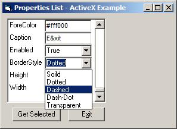



## DM Properties List

### Description

hi, I was working on a small project, were I needed to add properties to an control. so I decided to make this little quick code, does not use the DataGrid, as I did not want to use, over loaded controls, all this uses is TextBox and a ComboBox array. anyway code is faily simple, and it sort of does the job for small things, anyway hope you find it usfull.
 
### More Info
 

             |
---                |---
**Submitted On**   |2007-11-26 20:09:54
**By**             |[dreamvb](https://github.com/Planet-Source-Code/PSCIndex/blob/master/ByAuthor/dreamvb.md)
**Level**          |Beginner
**User Rating**    |5.0 (10 globes from 2 users)
**Compatibility**  |VB 5\.0, VB 6\.0
**Category**       |[Files/ File Controls/ Input/ Output](https://github.com/Planet-Source-Code/PSCIndex/blob/master/ByCategory/files-file-controls-input-output__1-3.md)
**World**          |[Visual Basic](https://github.com/Planet-Source-Code/PSCIndex/blob/master/ByWorld/visual-basic.md)
**Archive File**   |[DM\_Propert20920111262007\.zip](https://github.com/Planet-Source-Code/dreamvb-dm-properties-list__1-69680/archive/master.zip)

